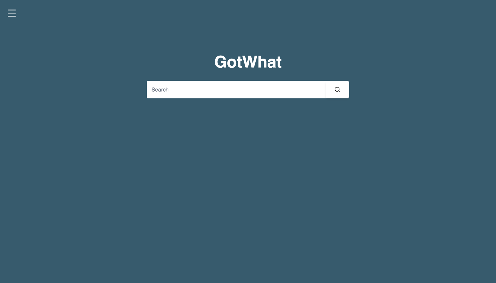
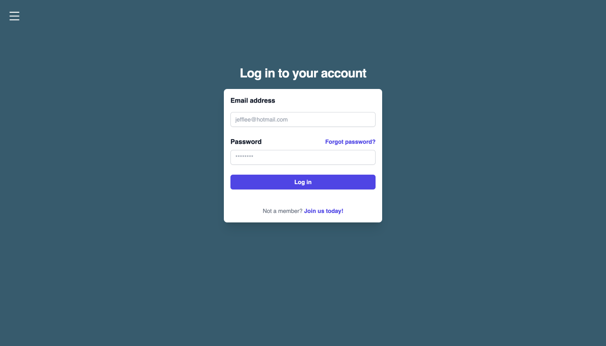
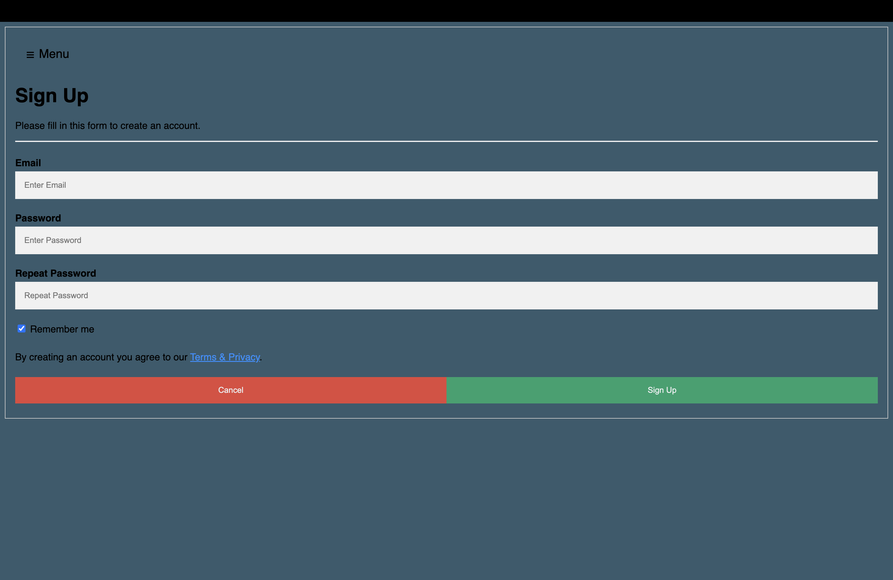
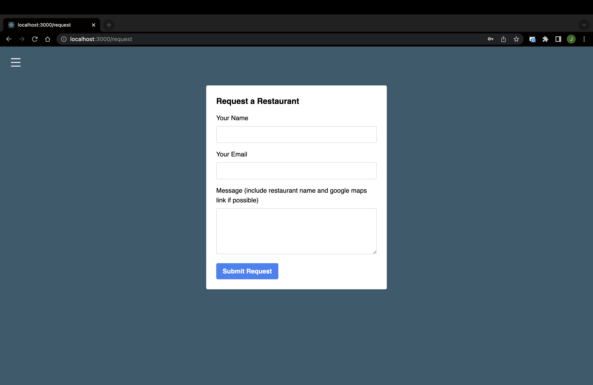
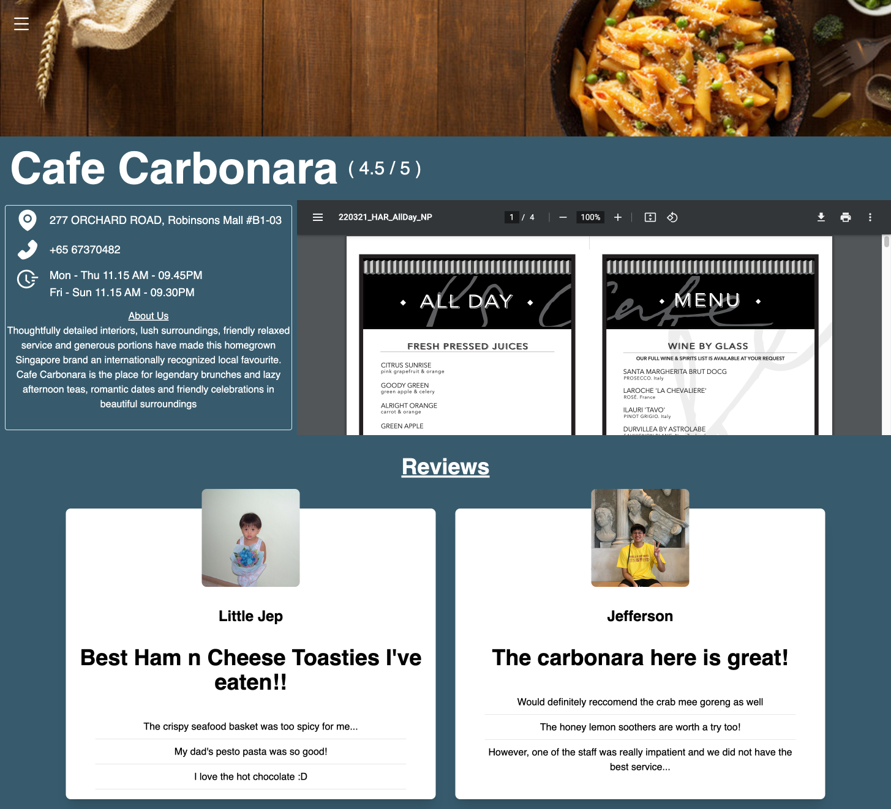

# **ORBITAL 23 - MILESTONE 1**

## **Team Name:**

GotWhat

## **Proposed Level of Achievement:**

Gemini

## **Motivation:**

We’ve always asked ourselves these burning questions when deciding to head out for a meal - What is there to eat at the restaurant? Is there an online menu? How much does the food there cost?

We then proceed to search on Google in the following format: “[Restaurant Name] menu”. 

If the restaurant has a decent website that displays their menu – great. If not, what we would usually do next is to Google Image search the same prompt, and then be faced with a multitude of blurry images that may or may not even be the right images of the menu. 

So why isn’t there a centralised platform for restaurants/food business owners to promote and display their menus? Could foodies (consumers) themselves come together to make it a better experience too?

## **Aim:**

We hope to make restaurant menus (and possibly their latest updates) readily accessible to foodies & the general public through a centralised platform (web app).

## **User Stories:**

1. As a new customer who has questions about the restaurant’s menu, I want to be able to
search the restaurant up and get quality answers right away (through menu PDFs).

2. As a new customer who wants to read up about the restaurant, I want to be able to see their basic
information and reviews.

3. As a customer who has visited the restaurant before, I want to be able to leave reviews
and upload images for others to refer to.

4. As a customer who is unable to find the restaurant on the webpage, I want to be able to fill
up a form to suggest a listing of the restaurant.

5. As a business owner, or marketer who wishes to improve his businesses’ online presence
and attract customers, I want to be able to upload/update the official menu.

6. As an business owner who wants to prevent misinformation in the reviews section, I want
to be able to reply and rectify any poor reviews provided.

## **Scope of Project:**

The website provides a neat “search engine-like” interface for customers to look for a restaurant’s menu and reviews. Business owners can upload the soft copies of the official menus to attract customers online.

The website has a database of restaurants, along with its menu & reviews.

## **Features to be completed by the mid of June:**

### 1. Webpage – Main Functionality

    a. Allow account creation for business owners / customers

    b. Allow business owners to upload menu PDFs/images

    c. Allow users to search for a restaurant’s menu

    d. Display restaurant basic information (address, operating hours, contact information & social media accounts)

## **Features to be completed by the mid of July:**

### 2. Webpage – Review Section

    a. Allow customers to leave ratings & reviews (& upload photos) for restaurant

    b. Allow business owners to reply to reviews

### 3. Webpage – Request Functionality

    a. Allow customers to suggest “missing restaurants” to be listed on webpage

    b. Allow backend to keep track and possibly contact restaurant to get on our webpage

## **Tech Stack:**

1. React (Frontend)

2. Express + Node.js

3. MongoDB (Backend)

## **How are we different from similar platforms?**

- Burpple

    - Our website is more informative, unlike Burpple where most consumers use Burpple for the Beyond feature which is a paid subscription to unlock access to 1-1 deals for certain partnering F&B businesses.

- Oddle

    - Our website is more menu-centric, whereas Oddle is centered more around its food ordering services (Delivery, Pickup, Reservations).

## **Development Plan:**

2nd week of May: Finalise deliverables for Orbital Lift-off

3rd week of May: Technical Knowledge Research - React, Nodejs, Expressjs, MongoDB, Git

4th week of May: Pick up technologies, Initialize project and design frontend

1st week of June: Design portal for business owners to edit restaurant menu/info

2nd week of June: Design restaurant information page

3rd week of June: Implement search functionality to search for restaurants

4th week of June: Testing and debugging

1st week of July: Implement additional capabilities – Review Section, Request Functionality

2nd week of July: Implementation of peer teams’ suggestions

3rd week of July: Testing and debugging

## **Website User Flow:**

The technical proof is as shown below:

*Sign Up Page will defer for Business Owners and Customers (yet to implement)*

**RESTAURANT PAGE (YET TO DESIGN/IMPLEMENT):**

