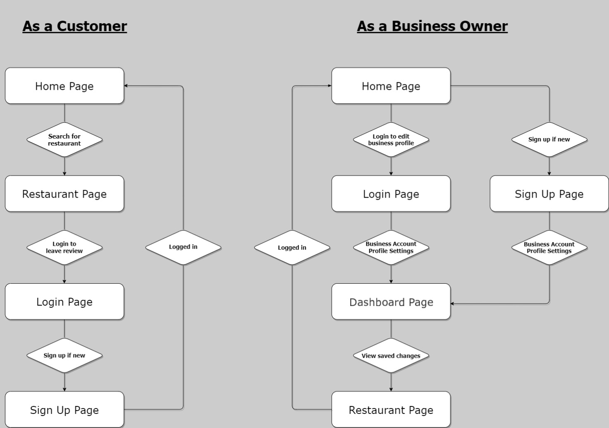
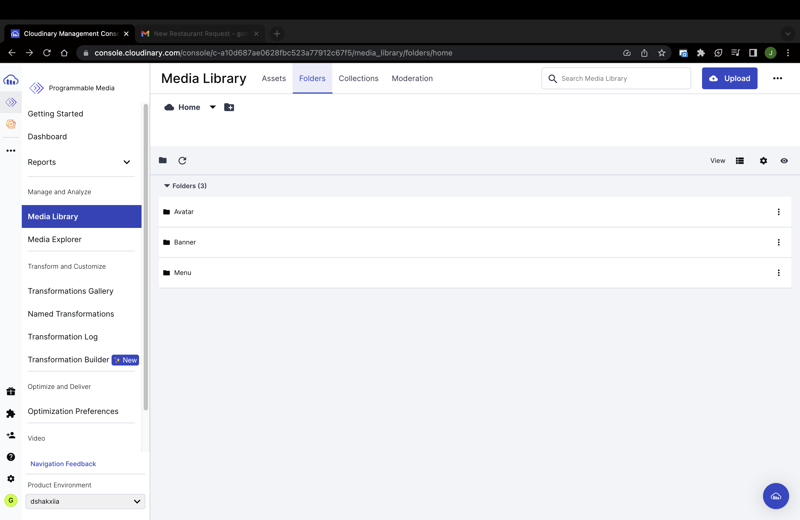

# **ORBITAL 23 - MILESTONE 3**

## **Team Name:**

GotWhat

## **Proposed Level of Achievement:**

Gemini

## **Motivation:**

We’ve always asked ourselves these burning questions when deciding to head out for a meal - What is there to eat at the restaurant? Is there an online menu? How much does the food there cost?

We then proceed to search on Google in the following format: “[Restaurant Name] menu”.

If the restaurant has a decent website that displays their menu – great. If not, what we would usually do next is to Google Image search the same prompt, and then be faced with a multitude of blurry images that may or may not even be the right images of the menu.

So why isn’t there a centralised platform for restaurants/food business owners to promote and display their menus? Could foodies (consumers) themselves come together to make it a better experience too?

## **Aim:**

We hope to make restaurant menus (and possibly their latest updates) readily accessible to foodies & the general public through a centralised platform (web app).

## **User Stories:**

1. As a new customer who has questions about the restaurant’s menu, I want to be able to
   search the restaurant up and get quality answers right away (through menu PDFs).

2. As a new customer who wants to read up about the restaurant, I want to be able to see their basic
   information and reviews.

3. As a customer who has visited the restaurant before, I want to be able to leave reviews
   and upload images for others to refer to.

4. As a customer who is unable to find the restaurant on the webpage, I want to be able to fill
   up a form to suggest a listing of the restaurant.

5. As a business owner, or marketer who wishes to improve his businesses’ online presence
   and attract customers, I want to be able to upload/update the official menu.

6. As an business owner who wants to prevent misinformation in the reviews section, I want
   to be able to reply and rectify any poor reviews provided.

## **Scope of Project:**

The website provides a neat “search engine-like” interface for customers to look for a restaurant’s menu and reviews. Business owners can upload the soft copies of the official menus to attract customers online.

## **How are we different from similar platforms?**

- Burpple

  - Our website is more informative, unlike Burpple where most consumers use Burpple for the Beyond feature which is a paid subscription to unlock access to 1-1 deals for certain partnering F&B businesses.

- Oddle

  - Our website is more menu-centric, whereas Oddle is centered more around its food ordering services (Delivery, Pickup, Reservations).

## **Tech Stack:**

1. React.js **[ Client ]**
2. Express + Node.js **[ Server ]**
3. MongoDB + Cloudinary **[ Server / DB ]**

## **Features Implemented:**

1. Webpage - Main Functionalities:

   a. Allow account creation for business owners / customer **[ LOGIN / SIGNUP ]**

   b. Allow business owners to upload menu PDFs/images **[ DASHBOARD ]**

   c. Allow users to search for a restaurant’s menu **[ SEARCH ]**

   d. Display restaurant basic information (address, operating hours, contact information) **[ RESTAURANT PAGE]**

   **FOR LOGIN / SIGNUP:**

   - Frontend handling via React. Input management and HTTP requests by Axios to the backend.
   - Backend handles the request via the route “/api/login” and “/api/signup”.
   - Requests will have their inputs checked by the middlewares “loginValidator” and “signupValidator” using express-validator and their respective messages will be handled by the next middleware “validator”, and finally by the respective controllers “Login” and “Signup”.

     

   **Backend Files involved: AuthRoute.js, AuthValidator.js, AuthController.js**

   **FOR DASHBOARD:**

   - Frontend gets user/restaurant information via a useEffect hook to check if the browser is authenticated via AuthContext, and sets the state of the different components on the DashboardPage.
   - Backend handles the request via the route “/api/user/” and the various endpoints (password, OH, address, contact, menu, banner, avatar, uploadavatar, uploadmenu, uploadbanner).
   - Routes are protected by isValidTokenMiddleware for uploading of assets, and validate middleware that checks if the browser is authenticated.
   - Uploading of assets to Cloudinary requires multer middleware to temporarily store the file to get a file path. Cloudinary returns a url to the file which is then stored in the MongoDB.

    

   **Backend Files involved: DashboardRoute.js, AuthLoginValidator.js, Multer.js, DashboardController.js**

   **FOR SEARCH:**

   - SearchBar is a React component on the Homepage.
   - SearchBar calls back the handleSearch function in the onSearch prop which is passed down from the parent (Homepage).
   - Search is initiated via an Axios GET request.
   - Backend handles query and launches a RegExp search on the Business Owners schema to find a matching restaurant name. An array of the Business Owner (restaurant) objects are returned.
   - Frontend handles the searchResult array into a dropdown menu and links it to the Restaurant page via the obj.\_id property.

    

   **Backend Files involved: SearchRoute.js, SearchController.js**

   **FOR RESTAURANT PAGE:**

   - Frontend uses a useEffect hook to make an Axios GET request to the backend.
   - Backend handles the route by checking the restaurantId for the req.params and searches the Business Owners schema in MongoDB for the matching obj.\_id, and returns the restaurant object.
   - Restaurant object is then handled by the frontend and loads up the assets to RestaurantCard and MenuViewer React components.

     

   **Backend Files involved: RestaurantRoute.js, RestaurantController.js**

     

2. Webpage - Request Functionality **[ REQUEST ]** :

   a. Allow customers to suggest “missing restaurants” to be listed on webpage

   b. Allows backend to keep track of requests via email and MongoDB

   **FOR REQUEST:**

   - Backend handles form inputs by saving the request in MongoDB under the Request Schema and also activates nodemailer to send an email to our business email.

     

   **Backend Files involved: RequesttRoute.js, RequestController.js**

**Features to be implemented in the future:**

3. Webpage – Review Section:

   a. Allow customers to leave ratings & reviews for restaurant

   b. Allow business owners to reply to reviews

## **Challenges Faced:**

- Struggled with backend code for middlewares, controllers, endpoints, APIs
- Struggled with linking backend and frontend (especially signup/login Auth contexts and isAuth backend checking)
- Struggled with React tailwindcss designs
- Struggled a lot with debugging clashing implementation of features (password updating, route protection)
- Yet to deploy webapp

## **Software Engineering Practices:**

- Version control with Git (via GitHub)
- Model-View-Controller (MVC) architectural pattern with React app and the backend server
- JWT tokens for Web App Authentication

## **Website User Flow:**

## **Data/Media Storage:**

### MongoDB

### Cloudinary

## **User Interface:**

### Homepage

### Restaurant Page

### Login Page

### Signup (as Customer)

### Signup (as Restaurant)

### Dashboard Page (before)

### Dashboard Page (after)

### Request Page

